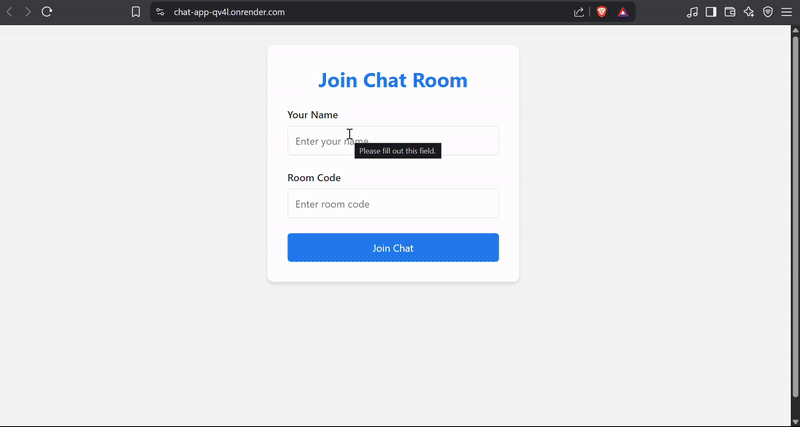

# Realtime Chat Application 💬

A feature-rich realtime chat application built with Node.js, Express, and Socket.io that supports multiple rooms and users.



## Features ✨

- **Realtime messaging** with Socket.io
- **Multiple chat rooms** support
- **User presence** tracking
- **Responsive design** works on all devices
- **Timestamps** on all messages
- **Online users** list
- **Join/leave notifications**

## Technologies Used 🛠️

- **Backend**: Node.js, Express
- **Realtime**: Socket.io
- **Frontend**: HTML5, CSS3, Vanilla JS
- **Deployment**: Render/Vercel (optional)

## Installation ⚙️

1. Clone the repository:
   ```bash
   git clone https://github.com/yourusername/chat-app
   cd chat-app

2. Install dependencies:
   ```bash
   npm install

3. Create a .env file:
   ```bash
    PORT=3000

4. Start the server:
   ```bash
   npm index.js

5. Open in browser:
   ```bash
   [git clone https://github.com/rohitkumarchaurasiya111/Live-Chat-Room
   cd chat-app](http://localhost:3000)

## Usage 🚀

-Enter your username and room code
-Start chatting with others in the same room
-See who's online in realtime
-Get notifications when users join/leave

## Project Structure 📂
 ```bash
  chat-app/
├── public/            # Client-side files
│   ├── chat.html      # Chat interface
│   ├── login.html     # Login page
│   ├── styles.css     # Main styles
│   └── screenshots/   # App screenshots
├── server.js          # Main server file
├── package.json
└── README.md
```

## 🚀 Live Demo

👉 https://chat-app-qv4l.onrender.com/

## Happy Chatting! 😊
